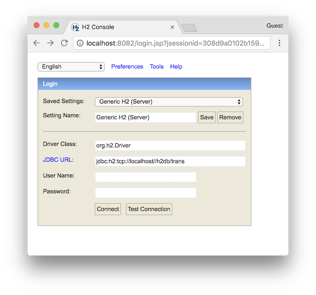

# trans-server-tcp-h2-docker-compose
[Trans Server](https://github.com/nwtgck/trans-server-akka) on server-mode H2 Database

## Run

Here is how to run the servers.

```bash
docker-compose up
```

## Ports

The following ports are open ports.

* <http://localhost:8080/> is Trans server
* <http://localhost:8082/> is H2 Database Web Console

## Data Persistence
All data for persistence are under `./docker_volumes`.

## How to access to H2 Database Web Console

1. Open <http://localhost:8082/> in your browser.
1. Select [Generic H2 (Server)] in "Saved Settings"
1. Fill "jdbc:h2:tcp://localhost//h2db/trans" in "JDBC URL"
1. Set empty name "" in "User Name"

The complete setting is like the following image.


